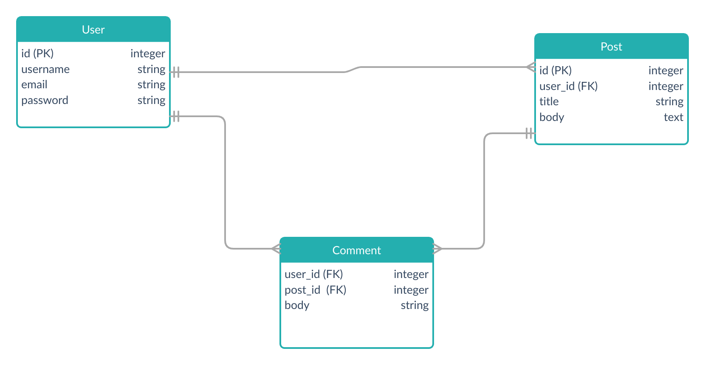

# Micro-Reddit

This project is a microverse collaborative project which is part of the requirements of the microverse main curriculum in the Rails section. The project is about creating the model part of the MVC desing pattern using Ruby on Rails MVC framework. As the project doesn't contain any views or controllers one can only discover migration and model classes.
      

<div align="center">

[](https://github.com/Dipeshtwis/blogger/tree/feature/article)
[](https://github.com/Dipeshtwis/blogger/issues)
[](https://github.com/Dipeshtwis/blogger/pulls)

</div>

## 📝 Content

<p align="center">
<a href="#with">Built with</a>&nbsp;&nbsp;&nbsp;|&nbsp;&nbsp;&nbsp;
<a href="#sc">Screenshot</a>&nbsp;&nbsp;&nbsp;|&nbsp;&nbsp;&nbsp;
<a href="#gs">Getting started</a>&nbsp;&nbsp;&nbsp;|&nbsp;&nbsp;&nbsp;
<a href="#author">Author</a>
</p>

## 🔧 Built with<a name = "with"></a>

- Ruby on Rails (Version: 6.0.3.2)
- Ruby (Version: 2.7.1)


## Database Model <a name = "sc"></a>




## Getting Started <a name = "gs"></a>

To get a local copy of the repository please run the following commands on your terminal:

```
$ cd <folder>
```

~~~bash
$ git clone git@github.com:temesghentekeste/micro-reddit.git
$ cd micro-reddit
$ bundle install
$ rails db:migrate
~~~


## ✒️  Authors <a name = "author"></a>

👤 **Temesghen Tekeste**

- Github: [@temesghentekeste](https://github.com/temesghentekeste)
- Twitter: [@temesghentekes1](https://twitter.com/temesghentekes1)
- Linkedin: [temsghen-tekeste-bahta-8b5243193](https://www.linkedin.com/in/temesghentekeste/)

👤 **Dipesh Kumar**

- Github: [@Dipeshtwis](https://github.com/Dipeshtwis)
- Twitter: [@97deepeshkumar](https://twitter.com/97deepeshkumar)
- Linkedin: [dipeshtwis](https://www.linkedin.com/in/dipeshtwis/)


## 🤝 Contributing

Contributions, issues and feature requests are welcome!

Feel free to check the [issues page](https://github.com/temesghentekeste/micro-reddit/issues).


## 👍 Show your support

Give a ⭐️ if you like this project!

## :clap: Acknowledgements

- Microverse: [@microverse](https://www.microverse.org/)